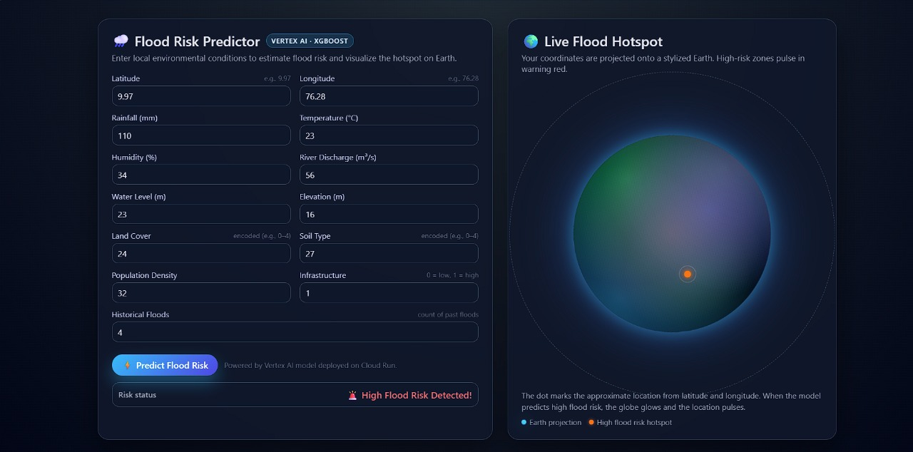
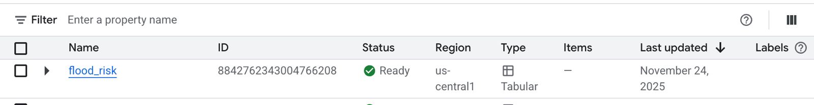
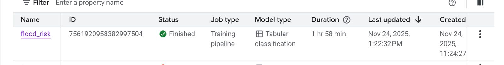

# 🌧️ Cloud-Native Flood Risk Prediction System


An AI-powered flood risk prediction platform built using **XGBoost**, **Google Vertex AI**, **Cloud Run**, and an interactive geospatial frontend for real-time flood risk visualization.

---

# 🌍 Project Overview

This system predicts flood risk using environmental, hydrological, geographical, and socio-economic features.

The application:

- Collects environmental parameters from users
- Sends data to a cloud-hosted ML model
- Predicts flood risk in real-time
- Visualizes flood-prone locations interactively
- Uses Google Cloud infrastructure for scalability

---

# ✨ Key Features

- ☁️ Cloud-native ML deployment
- 🤖 XGBoost flood prediction model
- 🌍 Interactive Earth-based visualization
- 📡 Real-time REST API inference
- 🚀 Google Cloud Run deployment
- 🧠 Vertex AI training pipeline
- 📊 Geospatial flood hotspot mapping
- ⚡ Scalable serverless backend

---

# 🏗️ System Architecture

```text
Frontend UI
     ↓
Cloud Run Backend API
     ↓
XGBoost ML Model
     ↓
Flood Risk Prediction
     ↓
Geospatial Visualization
```

---

# 📸 Screenshots

## 🌍 Flood Prediction Interface



---

## ☁️ Vertex AI Training Completion



---

## 🧠 Vertex AI Training Pipeline


---

## 🚀 Flood Model Deployment Registry



---

# 🧪 API Example

## Request

```bash
curl -X POST https://flood-risk-backend-v2-597320691578.us-central1.run.app/predict \
  -H "Content-Type: application/json" \
  -d '{
        "instances": [
          {
            "latitude": 9.97,
            "longitude": 76.28,
            "rainfall_mm": 120.5,
            "temperature_c": 28.3,
            "humidity_pct": 82,
            "river_discharge_m3s": 350.2,
            "water_level_m": 4.5,
            "elevation_m": 12.7,
            "land_cover": 3,
            "soil_type": 2,
            "population_density": 450,
            "infrastructure": 1,
            "historical_floods": 2
          }
        ]
      }'
```

## Example Response

```json
{
  "predictions": [1]
}
```

| Prediction | Meaning |
|------------|----------|
| 0 | Low Flood Risk |
| 1 | High Flood Risk |

---

# 🧠 Machine Learning Model

The flood prediction system uses an **XGBoost classifier** trained on:

- Rainfall intensity
- River discharge
- Water level
- Elevation
- Humidity
- Temperature
- Soil type
- Land cover
- Infrastructure index
- Historical flood records

The model was trained and deployed using **Google Vertex AI**.

---

# ☁️ Cloud Deployment

## Backend
- Flask API hosted on Google Cloud Run
- Public REST prediction endpoint

## Frontend
- Interactive frontend hosted using Google Cloud Storage

## ML Infrastructure
- Google Vertex AI
- Cloud Storage
- Cloud Run
- XGBoost

---

# 🔮 Future Improvements

- Real-time weather API integration
- Satellite data integration
- Flood severity classification
- Interactive GIS heatmaps
- Live rainfall monitoring
- Kubernetes deployment

---


# 📄 Research Report

Detailed project report available in:

```text
/docs/flood_prediction_report.pdf
```
